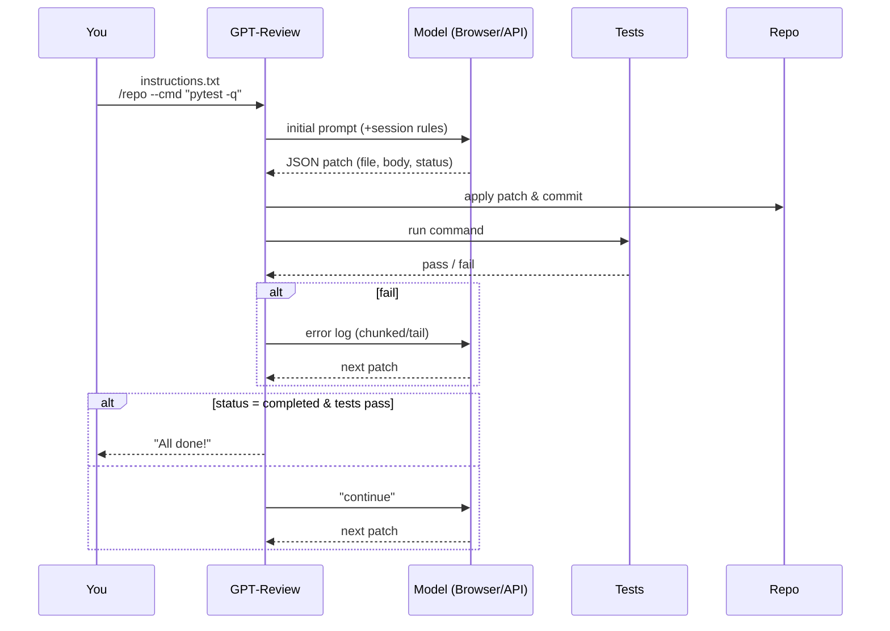

# GPT‑Review

**Browser‑ or API‑driven, ChatGPT‑powered code‑review loop**  
Edit → Run → Fix — until your tests pass.

<p align="center">
  
</p>

| Feature | Status |
|---------|--------|
| One‑file‑at‑a‑time patches | ✅ |
| ChatGPT must ask “continue” between chunks | ✅ |
| Runs any shell command after each patch | ✅ |
| Feeds failing logs back to ChatGPT (chunked/tail) | ✅ |
| Delete / Rename / Chmod ops | ✅ |
| Binary file support (body_b64) | ✅ |
| Crash‑safe resume (state file) | ✅ |
| Daily‑rotating logs | ✅ |
| **Browser mode**: chatgpt.com primary + chat.openai.com fallback | ✅ |
| **API mode** (GPT-Codex; e.g., gpt-5-codex) | ✅ |
| Transport toggle `--mode browser|api` | ✅ |
| Token‑thrifty API loop (rolling history + tailed logs) | ✅ |
| Chrome/Chromium auto‑detect + correct driver (browser mode) | ✅ |
| Env‑tunable timeouts/retries/chunk sizes | ✅ |
| Multi‑arch Docker (Debian + Chromium) | ✅ |
| Pre‑commit in CI + E2E Selenium smoke test | ✅ |
| **Login helper URL override** (`GPT_REVIEW_LOGIN_URL`) | ✅ |
| **Root‑safe visible login** (`--no-sandbox` auto) | ✅ |
| **Snap‑aware profile defaults** (Chromium confinement) | ✅ |
| Plan-first orchestrator + blueprint docs (.gpt-review) | ✅ |
| CLI utilities: manifest scan, schema dump, patch validator | ✅ |

---

## Table of Contents

1. [How it works](#how-it-works)  
2. [Quick start](#quick-start)  
   - [Quick start (Browser mode)](#quick-start-browser-mode)  
   - [Quick start (API mode)](#quick-start-api-mode)  
3. [Installation](#installation)  
   - [Debian/Ubuntu (one‑liner)](#debianubuntu-one-liner)  
   - [pip / virtual‑env](#pip--virtual-env)  
   - [Docker](#docker)  
   - [Update (in‑place upgrade)](#update-in-place-upgrade)  
4. [First‑time login (browser mode)](#first-time-login-browser-mode)  
   - [macOS client (XQuartz) + SSH X‑forwarding](#macos-client-xquartz--ssh-x-forwarding)  
   - [Headless servers (Xvfb + VNC alternative)](#headless-servers-xvfb--vnc-alternative)  
   - [Browser choices: Google Chrome vs Snap Chromium](#browser-choices-google-chrome-vs-snap-chromium)  
5. [Usage](#usage)  
6. [Command-line tools](#command-line-tools)  
   - [gpt-review CLI](#gpt-review-cli)  
   - [Wrapper: software_review.sh](#wrapper-software_reviewsh)  
   - [`python -m gpt_review`](#python--m-gpt_review)  
7. [Session rules](#session-rules)  
8. [Environment & configuration](#environment--configuration)  
   - [Shared toggles](#shared-toggles)  
   - [Browser mode variables](#browser-mode-variables)  
   - [API mode variables](#api-mode-variables)  
9. [Advanced](#advanced)  
10. [Development](#development)  
11. [CI pipelines](#ci-pipelines)  
12. [Troubleshooting](#troubleshooting)  
13. [Security](#security)  
14. [License](#license)  


---

## How it works

**Transport:**  
- **Browser mode** uses Selenium to interact with chatgpt.com (with chat.openai.com fallback).  
- **API mode** calls the GPT-Codex endpoint directly (e.g., gpt-5-codex) without launching a browser.

---

## Quick start

### Quick start (Browser mode)

> **Requirements:** Python **3.10+**, Git, and a Chromium/Chrome browser.

```bash
# 1) Install system deps + package (needs sudo)
#    Add INSTALL_GOOGLE_CHROME=1 to install non‑snap Google Chrome (recommended).
curl -sSL https://raw.githubusercontent.com/bekirdag/gpt_review/main/install.sh | sudo INSTALL_GOOGLE_CHROME=1 bash

# 2) One‑time visible login (saves cookies)
cookie_login.sh
# (Optional) If your SSO/region needs a different entrypoint:
#   export GPT_REVIEW_LOGIN_URL="https://your-entrypoint.example/"
#   cookie_login.sh

# 3) Run the review loop
software_review.sh instructions.txt  /path/to/git/repo  --cmd "pytest -q"
# Add --auto to auto‑press "continue" after each chunk.
```

> After cookies exist, headless is fine:
> ```bash
> export GPT_REVIEW_HEADLESS=1
> software_review.sh instructions.txt /repo --cmd "pytest -q" --auto
> ```

### Quick start (API mode)

> **Requirements:** Python **3.10+**, Git, and access to the GPT-Codex API (for example `gpt-5-codex`).  
> Install the Codex SDK once: `pip install gpt-5-codex-client`

```bash
export GPT_CODEX_API_KEY="sk-..."
# Optional if using a custom endpoint/proxy:
# export GPT_CODEX_BASE_URL="https://api.your-endpoint.example/v1"

# Run in API mode against GPT-5 Codex
software_review.sh instructions.txt /repo --mode api --model gpt-5-codex --cmd "pytest -q" --auto
```

API mode avoids Selenium/Chrome entirely and is **token‑thrifty**:
- Rolling history window (keeps the last few exchanges)
- Error logs are **tailed** to a maximum character budget
- Temperature fixed at 0; compact prompts

---

## Installation

### Debian/Ubuntu (one‑liner)

```bash
curl -sSL https://raw.githubusercontent.com/bekirdag/gpt_review/main/install.sh | sudo INSTALL_GOOGLE_CHROME=1 bash
```

The installer:
* Installs Python, Git, **Google Chrome** (if `INSTALL_GOOGLE_CHROME=1`) or **Chromium** (fallback), Xvfb.
* Clones to `/opt/gpt-review` (override with `REPO_DIR`).
* Creates a virtual‑env at `/opt/gpt-review/venv`.
* Installs the package in editable mode.
* Adds launchers: `gpt-review`, `software_review.sh`, and `cookie_login.sh`.

> **API mode:** ensure the GPT-Codex SDK is available in the same environment:
> ```bash
> pip install gpt-5-codex-client
> ```

### pip / virtual‑env

```bash
git clone https://github.com/bekirdag/gpt_review.git
cd gpt-review
python -m venv venv && . venv/bin/activate
pip install -e .[dev]
# For API mode, add:
pip install gpt-5-codex-client
```

### Docker

The official image is Debian‑based and uses system **Chromium** (headless by default).

```bash
docker build -t gpt-review .

docker run -it --rm   -v $HOME/.cache/gpt-review/chrome:/home/nonroot/.cache/chrome   -v "$(pwd)":/workspace   gpt-review /workspace/example_instructions.txt /workspace   --cmd "pytest -q" --auto
```

### Update (in‑place upgrade)

To update an existing install (default path `/opt/gpt-review`):

```bash
curl -sSL https://raw.githubusercontent.com/bekirdag/gpt_review/main/update.sh | sudo bash -s -- --force
```

**Flags:**

* `-d, --repo /path` — update a non‑default clone (default: `/opt/gpt-review`)
* `-b, --branch <name>` — pick a branch (default: `main`)
* `-f, --force` — discard local changes (hard reset)

The script pulls the latest code, reinstalls the package in the bundled
virtual‑env, and refreshes launchers: **gpt-review**, **software_review.sh**,
**cookie_login.sh**, and **gpt-review-update**.

---

## First‑time login (browser mode)

Run the helper once:

```bash
cookie_login.sh
```

A browser opens with **https://chatgpt.com** (plus a **chat.openai.com** tab as fallback).  
Sign in, verify you can chat, then **close** the window. Cookies are stored under:

```
~/.cache/gpt-review/chrome   # override with GPT_REVIEW_PROFILE
```

Tip: For corporate SSO or regional routing, set a custom URL:
```bash
export GPT_REVIEW_LOGIN_URL="https://your-entrypoint.example/"
cookie_login.sh
```

### macOS client (XQuartz) + SSH X‑forwarding

1. Install **XQuartz** (macOS 14+ supported):
   ```bash
   brew install --cask xquartz
   ```
2. **Log out** of macOS and log back in (required by XQuartz).
3. Open XQuartz → Preferences → **Security** → check **“Allow connections from network clients.”**
4. In Terminal:
   ```bash
   open -a XQuartz
   xhost +localhost
   ssh -Y <user>@<server>      # trusted X11 forwarding
   ```
5. On the server:
   ```bash
   echo $DISPLAY                # expect localhost:10.0 (or similar)
   sudo apt-get update && sudo apt-get install -y x11-apps
   xclock                       # clock should render on your Mac
   cookie_login.sh              # this will open Chrome/Chromium on your Mac
   ```

### Headless servers (Xvfb & VNC alternative)

If SSH X‑forwarding isn’t available, create a virtual display and VNC session:

```bash
sudo apt-get install -y xvfb x11vnc fluxbox
export DISPLAY=:99
Xvfb :99 -screen 0 1280x900x24 &
fluxbox >/dev/null 2>&1 &
x11vnc -display :99 -nopw -forever -shared -rfbport 5900 >/dev/null 2>&1 &
cookie_login.sh
# On your laptop: ssh -L 5900:localhost:5900 <user>@<server> ; then open vnc://localhost:5900
```

### Browser choices: Google Chrome vs Snap Chromium

**Google Chrome (non‑snap, recommended)** on Ubuntu:
```bash
sudo apt-get update && sudo apt-get install -y wget gpg
wget -qO- https://dl.google.com/linux/linux_signing_key.pub | sudo gpg --dearmor | sudo tee /usr/share/keyrings/google-linux.gpg >/dev/null
echo "deb [arch=amd64 signed-by=/usr/share/keyrings/google-linux.gpg] http://dl.google.com/linux/chrome/deb/ stable main" | sudo tee /etc/apt/sources.list.d/google-chrome.list
sudo apt-get update && sudo apt-get install -y google-chrome-stable
export CHROME_BIN=/usr/bin/google-chrome
```

**Snap Chromium** is confined. Prefer a **snap‑writable** profile path:
```bash
export CHROME_BIN=/snap/bin/chromium
export GPT_REVIEW_PROFILE="$HOME/snap/chromium/current/gpt-review-profile"
mkdir -p "$GPT_REVIEW_PROFILE"
```

> The login helper detects root and **auto‑adds `--no-sandbox`** to Chrome/Chromium.

---

## Usage

### Minimal

```bash
# Browser (default)
software_review.sh instructions.txt /repo

# API
software_review.sh instructions.txt /repo --mode api --model gpt-5-codex
```

### Full CLI

| Flag | Default | Purpose |
|------|---------|---------|
| `instructions.txt` | — | Plain‑text goals for ChatGPT |
| `/repo` | — | Path to local **Git** repository |
| `--cmd "pytest -q"` | _(none)_ | Command must exit 0 before loop stops |
| `--auto` | off | Auto‑send **continue** after each patch |
| `--timeout 600` | 300 | Kill command after *N* seconds |
| `--mode {browser,api}` | browser | Transport: Selenium or GPT-Codex API |
| `--model gpt-5-codex` | env: `GPT_REVIEW_MODEL` | Model name for API mode |
| `--api-timeout 120` | env: `GPT_REVIEW_API_TIMEOUT` | API call timeout (seconds) |

### JSON contract

> **Return exactly one JSON object** per reply — no extra prose, no fences.

```jsonc
{ "op": "create|update|delete|rename|chmod",
  "file": "relative/path",
  // create / update
  "body": "text file contents",
  "body_b64": "<base64>",        // binary
  // rename
  "target": "new/path",
  // chmod
  "mode": "755",
  "status": "in_progress|completed"
}
```

---

## Command-line tools

### gpt-review CLI

`gpt-review` is the primary console script. It accepts either a local Git checkout or a Git URL (cloned into a temporary worktree) plus a plain-text instructions file.

| Subcommand | Purpose | Highlights |
|-----------|---------|------------|
| `iterate` | Multi-iteration orchestrator (plan-first workflow) | Blueprint preflight, plan artifacts, per-iteration branches, optional push/PR |
| `api` | Browser-free patch loop using the API driver | Runs `--cmd` after each patch, blueprint summaries, log tailing |
| `scan` | Print deterministic manifest of repository contents | `--max-lines` trims output for large repos |
| `validate` | Validate a single patch payload against the schema | Accepts `--payload`, `--file`, or stdin via `-` |
| `schema` | Dump the active JSON schema | Handy for tooling integrations |
| `version` / `--version` | Print package version | Available as a global flag on every command |

**iterate essentials**

- Runs the plan-first step, generates blueprint documents under `.gpt-review/blueprints/`, and writes plan artifacts (`INITIAL_REVIEW_PLAN.md`, `.gpt-review/initial_plan.json`, `.gpt-review/review_plan.json`, `REVIEW_GUIDE.md`).
- Creates one branch per iteration (`iteration1` → `iteration3` by default); override with `--branch-prefix` or `GPT_REVIEW_BRANCH_PREFIX`.
- Pushes the final branch to `--remote` (default `origin` or `GPT_REVIEW_REMOTE`) unless `--no-push` is set.
- Optional `--run "<command>"` enables the error-fix loop until the command passes.
- Set `GPT_REVIEW_CREATE_PR=1` to attempt a pull request after pushing when GitHub credentials are available.
- Accepts Git URLs; repositories are cloned into a temporary directory automatically.

**api essentials**

- Uses the strict `submit_patch` tool contract and runs `--cmd` after each successful patch (default `--timeout` 300s).
- Shares model/timeout flags with `iterate` (`--model`, `--api-timeout`) and honours the same `GPT_REVIEW_MODEL` / `GPT_REVIEW_API_TIMEOUT` defaults.
- Injects blueprint summaries by default; toggle with `GPT_REVIEW_INCLUDE_BLUEPRINTS` and `GPT_REVIEW_BLUEPRINT_SUMMARY_MAX_BYTES`.
- Limits conversation history via `GPT_REVIEW_CTX_TURNS` and only sends the tail of logs (`GPT_REVIEW_LOG_TAIL_CHARS`).

### Wrapper: software_review.sh

The shell wrapper provides a memorable entry point and logging conveniences while delegating to `gpt-review`.

| Flag | Purpose |
|------|---------|
| `--load-dotenv[=PATH]` | Source `.env` (or the provided path) before running |
| `--env-dump` | Print the effective mode, profile, timeouts, and API settings |
| `--fresh` | Remove `<repo>/.gpt-review-state.json` before starting |
| `--no-log` / `--log-file PATH` | Control wrapper logging (defaults to `logs/wrapper-YYYYMMDD-HHMMSS.log`) |
| `--api` / `--model` | Convenience aliases that rewrite to `--mode api` / `--model …` |
| `--version` | Print the underlying `gpt-review` version and exit |

Additional notes:

- Validates that the instructions file exists and that the target is a Git repo or worktree.
- Derives `--mode` / `--model` when omitted, based on `--api`, `GPT_REVIEW_MODE`, and `GPT_REVIEW_MODEL`.
- Forwards all remaining arguments untouched, so you can pass `--cmd`, `--auto`, `--timeout`, and other CLI flags.

### `python -m gpt_review`

The module entry point prints a concise startup banner and forwards to the same CLI driver. It supports a fast-path `--version` that avoids importing heavy dependencies, which keeps CI smoke tests and health checks lightweight.


## Session rules

1. **One patch per reply** – ChatGPT must modify **one file at a time**.  
2. **Ask before next chunk** – After sending a patch, ChatGPT must say  
   *“Let me know when to continue”* (or similar).  
3. GPT‑Review replies *continue* automatically when `--auto` is set, or waits
   for you to press **Enter**.

These rules keep commit history readable and make rollbacks trivial.

---

## Environment & configuration

A `.env.example` is provided.

### Shared toggles

* `GPT_REVIEW_BRANCH_PREFIX` – prefix for iteration branches (default: `iteration`).  
* `GPT_REVIEW_REMOTE` – Git remote pushed by the orchestrator (default: `origin`).  
* `GPT_REVIEW_ITERATIONS` – default number of passes for `gpt-review iterate` (1–3, default: `3`).  
* `GPT_REVIEW_CREATE_PR` – set to `1` to attempt creating a pull request after pushing (requires `gh` or API credentials).  
* `GPT_REVIEW_MAX_PROMPT_BYTES` – truncate prompts when sending very large files (default: `200000`).  
* `GPT_REVIEW_HEAD_TAIL_BYTES` – size of head/tail slices used when truncating (default: `60000`).  
* `GPT_REVIEW_LOG_TAIL_CHARS` – characters from the end of failing logs forwarded to the model (default: `20000`).  
* `GPT_REVIEW_MAX_ERROR_ROUNDS` – cap on error-fix retries during orchestrated runs (default: `6`).  

### Browser mode variables

* **Browser & URL**
  * `GPT_REVIEW_CHAT_URL` – preferred ChatGPT domain for the **driver** (default: `https://chatgpt.com/`)  
    Fallback to `https://chat.openai.com/` is automatic.
  * `GPT_REVIEW_LOGIN_URL` – primary login URL for **`cookie_login.sh`** (default: `https://chatgpt.com/`).  
    A fallback tab to `https://chat.openai.com/` is opened unless the URLs are identical.
  * `GPT_REVIEW_PROFILE` – Chrome profile dir for cookies  
    - Non‑snap default: `~/.cache/gpt-review/chrome`  
    - Snap Chromium: `~/snap/chromium/current/gpt-review-profile`
  * `CHROME_BIN` – explicit browser binary (`/usr/bin/google-chrome`, `/usr/bin/chromium`, `/snap/bin/chromium`)
  * `GPT_REVIEW_HEADLESS` – any non‑empty value enables new headless mode

* **Timings & retries**
  * `GPT_REVIEW_WAIT_UI` – max seconds to wait for UI/replies (default: `90`)
  * `GPT_REVIEW_STREAM_IDLE_SECS` – idle seconds to consider streaming finished (default: `2`)
  * `GPT_REVIEW_RETRIES` – retry count for brittle actions (default: `3`)
  * `GPT_REVIEW_COMMAND_TIMEOUT` – default `--timeout` (seconds, default: `300`)

* **Error‑log chunking**
  * `GPT_REVIEW_CHUNK_SIZE` – max characters per chunk when sending logs back (default: `15000`)

* **Logging**
  * `GPT_REVIEW_LOG_DIR` – directory for rotating log files (default: `logs`)
  * `GPT_REVIEW_LOG_LVL` – console level (`INFO` by default)
  * `GPT_REVIEW_LOG_ROT` – rotation schedule (default: `midnight`)
  * `GPT_REVIEW_LOG_BACK` – number of backups (default: `7`)
  * `GPT_REVIEW_LOG_UTC` – truthy values switch console timestamps to UTC.
  * `GPT_REVIEW_LOG_JSON` – truthy values emit JSON lines to stdout (useful in CI).

### API mode variables

* **Endpoint & Identity**
  * `GPT_CODEX_API_KEY` – API key (required; honours legacy `OPENAI_API_KEY`).  
  * `GPT_CODEX_BASE_URL` / `GPT_CODEX_API_BASE` – custom endpoint (optional; aliases `OPENAI_BASE_URL` / `OPENAI_API_BASE` still work).
  * `GPT_CODEX_ORG_ID` / `GPT_CODEX_ORGANIZATION` – org scoping (optional; legacy `OPENAI_ORG_ID` / `OPENAI_ORGANIZATION` recognised).

* **Model & runtime**
  * `GPT_REVIEW_MODEL` – default model for API mode (e.g., `gpt-5-codex`).  
  * `GPT_REVIEW_API_TIMEOUT` – per-request timeout (seconds, default: `120`).  
  * `GPT_REVIEW_CTX_TURNS` – rolling history window (assistant/user pairs to keep, default: `6`).  
  * `GPT_REVIEW_LOG_TAIL_CHARS` – max characters from the tail of failing logs to send back (default: `20000`).  
  * `GPT_REVIEW_INCLUDE_BLUEPRINTS` – set to `0` to skip blueprint preflight in API runs (default: `1`).  
  * `GPT_REVIEW_BLUEPRINT_SUMMARY_MAX_BYTES` – cap for the injected blueprint summary (default: `12000`).

Apply env quickly with:

```bash
set -a
. ./.env
set +a
```

---

## Advanced

### Iteration workflow (multi‑pass)

Iterations **1–2** focus on code + tests. Iteration **3** may update docs/setup/examples for global consistency.  
This is enforced by the `RepoScanner` + orchestrator and reflected in prompts.

### Blueprint docs & plan artifacts

The orchestrator and API driver ensure the four blueprint documents live under `.gpt-review/blueprints/` (`WHITEPAPER.md`, `BUILD_GUIDE.md`, `SDS.md`, `PROJECT_INSTRUCTIONS.md`). Missing files are created via the patch pipeline so each commit stays one-file-per-change.

During the plan-first step GPT-Review also writes:

- `.gpt-review/initial_plan.json` and `INITIAL_REVIEW_PLAN.md` with the initial run/test plan.
- `.gpt-review/review_plan.json` and `REVIEW_GUIDE.md` after iteration 3.

Control the behaviour with `GPT_REVIEW_INCLUDE_BLUEPRINTS` (set to `0` to skip in API runs) and `GPT_REVIEW_BLUEPRINT_SUMMARY_MAX_BYTES` to bound the injected summary size.

### Safety nets

* Path traversal blocked (`..`, absolute paths, backslashes).  
* No writes inside `.git/`.  
* Refuses to clobber locally‑modified files.  
* **Scoped staging**: commits touch only the intended paths (no parent‑dir sweep).  
* Chmod whitelist (0644/755; accepts 3‑ or 4‑digit octal).  
* Text normalization (LF, trailing newline).  
* Binary create/update via `body_b64` (strict Base64).

### Full‑file API driver

API workflows can propose **complete file replacements** (not diffs). The `fullfile_api_driver.py` tool enforces that the model returns an explicit `keep/update/create/delete` decision and provides full content when changing a file.

---

## Development

```bash
make install     # create venv + install dev deps
make fmt         # isort → black
make precommit   # run all pre-commit hooks
make lint        # flake8 + codespell
make test        # pytest + coverage
make e2e         # headless browser smoke test
make smoke       # CLI entrypoint sanity (version/help)
make login       # open visible browser to save cookies
make changelog   # print Unreleased section from CHANGELOG.md
```
For API mode development, ensure the SDK is present:
```bash
pip install "openai>=1.0.0"
```

Pre‑commit hooks ensure Black, isort, flake8, codespell, JSON/YAML/TOML checks
run on every commit.

---

## CI pipelines

Two GitHub Actions workflows:

* **CI** – pre‑commit lint + unit tests across Python 3.10 / 3.11 / 3.12, with coverage.  
  The CI job also appends the **“Unreleased”** section from the changelog to the job summary for fast PR review.
* **E2E Smoke** – launches a real Chrome/Chromium via Selenium to catch driver/browser mismatches early.

> Future work: add an API‑mode smoke that calls a mocked endpoint for hermetic CI.

---

## Troubleshooting

**Browser mode**

* **No window / instant Chrome exit (SSH)**  
  - Ensure `echo $DISPLAY` prints something like `localhost:10.0`.  
  - Test with `xclock`.  
  - If Snap Chromium, move profile to a snap‑writable path.  
  - For root sessions, the login helper auto‑adds `--no-sandbox`.

* **“User data directory is already in use”**  
  - Close any other Chrome/Chromium using your profile.  
  - Or clone to a temporary run profile:  
    ```bash
    BASE="$HOME/.cache/gpt-review/chrome"
    RUN="$HOME/.cache/gpt-review/run-$(date +%s)"
    rsync -a --delete --exclude='**/Cache' --exclude='**/Code Cache' --exclude='**/GPUCache' "$BASE"/ "$RUN"/
    export GPT_REVIEW_PROFILE="$RUN"
    software_review.sh instructions.txt /repo --cmd "pytest -q" --auto
    ```

* **“No composer textarea found”**  
  - Ensure you’re logged in (`cookie_login.sh`). The driver searches for `<textarea>` and clears drafts before sending.

* **Driver/browser mismatch**  
  - Set `CHROME_BIN` to the exact browser binary; the driver auto‑selects a matching chromedriver.

* **CI headless stability**  
  - Keep `GPT_REVIEW_HEADLESS=1` and avoid custom flags.

* **Long logs not fully received by ChatGPT**  
  - Consider lowering `GPT_REVIEW_CHUNK_SIZE`.

* **Stuck session**  
  - Remove `.gpt-review-state.json` and re‑run.

* **Regional/SSO login quirks**  
  - Set `GPT_REVIEW_LOGIN_URL` to your organisation’s entrypoint; a fallback tab to `https://chat.openai.com/` opens unless identical.

**API mode**

* **401 Unauthorized**  
  - Check `GPT_CODEX_API_KEY` (or legacy `OPENAI_API_KEY`) and any organisation scoping.

* **404/`model_not_found`**  
  - Verify `--model` (or `GPT_REVIEW_MODEL`) is available to your account/endpoint.

* **429 Rate limit**  
  - Rerun later or lower concurrency; API mode already limits history and tails logs to reduce tokens.

* **Connection errors / gateway timeouts**  
  - Increase `--api-timeout` or set a closer `GPT_CODEX_BASE_URL` proxy.

* **Costs creep up**  
  - Lower `GPT_REVIEW_CTX_TURNS` and/or `GPT_REVIEW_LOG_TAIL_CHARS`. Use narrower `--cmd` output when possible.

---

## Security

* Never commit secrets. `.env` is ignored by default.  
* The tool never prints `GPT_CODEX_API_KEY` (legacy `OPENAI_API_KEY`); avoid echoing it in shells or logs.  
* Review logs before sharing externally; redact repository paths if needed.

---

## License

MIT © GPT‑Review Team. See [LICENSE](LICENSE) for details.
