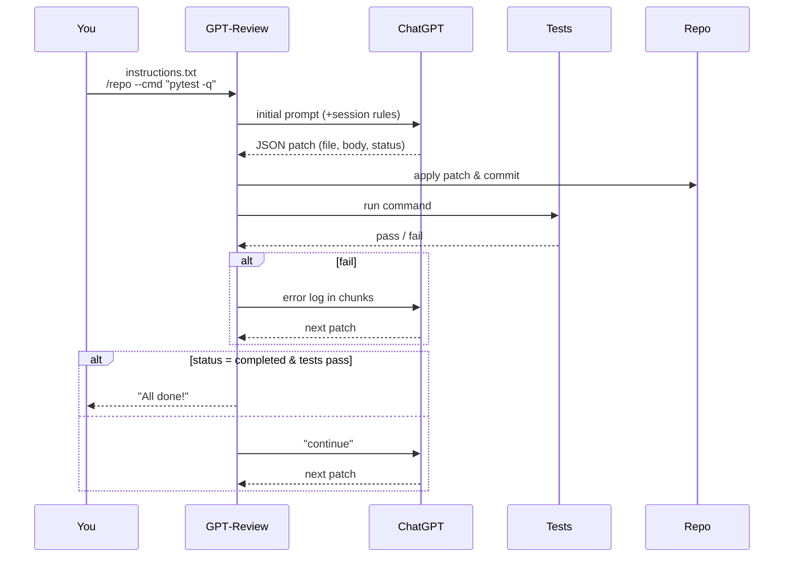

# GPT‑Review

**Browser‑driven, ChatGPT‑powered code‑review loop**  
Edit → Run → Fix — until your tests pass.

<p align="center">
  
</p>

| Feature | Status |
|---------|--------|
| One‑file‑at‑a‑time patches | ✅ |
| ChatGPT must ask “continue” between chunks | ✅ |
| Runs any shell command after each patch | ✅ |
| Feeds failing logs back to ChatGPT (chunked) | ✅ |
| Delete / Rename / Chmod ops | ✅ |
| Binary file support (body_b64) | ✅ |
| Crash‑safe resume (state file) | ✅ |
| Daily‑rotating logs | ✅ |
| **chatgpt.com** primary + chat.openai.com fallback | ✅ |
| Chrome/Chromium auto‑detect + correct driver | ✅ |
| Env‑tunable timeouts/retries/chunk sizes | ✅ |
| Multi‑arch Docker (Debian + Chromium) | ✅ |
| Pre‑commit in CI + E2E Selenium smoke test | ✅ |
| **Login helper URL override** (`GPT_REVIEW_LOGIN_URL`) | ✅ |
| **Root‑safe visible login** (`--no-sandbox` auto) | ✅ |
| **Snap‑aware profile defaults** (Chromium confinement) | ✅ |

---

## Table of Contents

1. [How it works](#how-it-works)  
2. [Quick start](#quick-start)  
3. [Installation](#installation)  
   - [Debian/Ubuntu (one‑liner)](#debianubuntu-one-liner)  
   - [pip / virtual‑env](#pip--virtual-env)  
   - [Docker](#docker)  
4. [First‑time login](#first-time-login)  
   - [macOS client (XQuartz) + SSH X‑forwarding](#macos-client-xquartz--ssh-x-forwarding)  
   - [Headless servers (Xvfb + VNC alternative)](#headless-servers-xvfb--vnc-alternative)  
   - [Browser choices: Google Chrome (recommended) vs Snap Chromium](#browser-choices-google-chrome-recommended-vs-snap-chromium)  
5. [Usage](#usage)  
6. [Session rules](#session-rules)  
7. [Environment & configuration](#environment--configuration)  
8. [Advanced](#advanced)  
9. [Development](#development)  
10. [CI pipelines](#ci-pipelines)  
11. [Troubleshooting](#troubleshooting)  
12. [License](#license)  

---

## How it works


---

## Quick start

> **Requirements:** Python **3.10+**, Git, and a Chromium/Chrome browser.

```bash
# 1) Install system deps + package (needs sudo)
#    Add INSTALL_GOOGLE_CHROME=1 to install non‑snap Google Chrome (recommended).
curl -sSL https://raw.githubusercontent.com/bekirdag/gpt_review/main/install.sh | sudo INSTALL_GOOGLE_CHROME=1 bash

# 2) One‑time visible login (saves cookies)
cookie_login.sh
# (Optional) If your SSO/region needs a different entrypoint:
#   export GPT_REVIEW_LOGIN_URL="https://your-entrypoint.example/"
#   cookie_login.sh

# 3) Run the review loop
software_review.sh instructions.txt  /path/to/git/repo  --cmd "pytest -q"
# Add --auto to auto‑press "continue" after each chunk.
```

> After cookies exist, headless is fine:
> ```bash
> export GPT_REVIEW_HEADLESS=1
> software_review.sh instructions.txt /repo --cmd "pytest -q" --auto
> ```

---

## Installation

### Debian/Ubuntu (one‑liner)

```bash
curl -sSL https://raw.githubusercontent.com/bekirdag/gpt_review/main/install.sh | sudo INSTALL_GOOGLE_CHROME=1 bash
```

The installer:
* Installs Python, Git, **Google Chrome** (if `INSTALL_GOOGLE_CHROME=1`) or **Chromium** (fallback), Xvfb.
* Clones to `/opt/gpt-review` (override with `REPO_DIR`).
* Creates a virtual‑env at `/opt/gpt-review/venv`.
* Installs the package in editable mode.
* Adds launchers: `gpt-review`, `software_review.sh`, and `cookie_login.sh`.

### pip / virtual‑env

```bash
git clone https://github.com/bekirdag/gpt_review.git
cd gpt-review
python -m venv venv && . venv/bin/activate
pip install -e .[dev]
```

### Docker

The official image is Debian‑based and uses system **Chromium** (headless by default).

```bash
docker build -t gpt-review .

docker run -it --rm \
  -v $HOME/.cache/gpt-review/chrome:/home/nonroot/.cache/chrome \
  -v "$(pwd)":/workspace \
  gpt-review /workspace/example_instructions.txt /workspace \
  --cmd "pytest -q" --auto
```

---

## First‑time login

Run the helper once:

```bash
cookie_login.sh
```

A browser opens with **https://chatgpt.com** (plus a **chat.openai.com** tab as fallback).  
Sign in, verify you can chat, then **close** the window. Cookies are stored under:

```
~/.cache/gpt-review/chrome   # override with GPT_REVIEW_PROFILE
```

Tip: For corporate SSO or regional routing, set a custom URL:
```bash
export GPT_REVIEW_LOGIN_URL="https://your-entrypoint.example/"
cookie_login.sh
```

### macOS client (XQuartz) + SSH X‑forwarding

1. Install **XQuartz** (macOS 14+ supported):
   ```bash
   brew install --cask xquartz
   ```
2. **Log out** of macOS and log back in (required by XQuartz).
3. Open XQuartz → Preferences → **Security** → check **“Allow connections from network clients.”**
4. In Terminal:
   ```bash
   open -a XQuartz
   xhost +localhost
   ssh -Y <user>@<server>      # trusted X11 forwarding
   ```
5. On the server:
   ```bash
   echo $DISPLAY                # expect localhost:10.0 (or similar)
   sudo apt-get update && sudo apt-get install -y x11-apps
   xclock                       # clock should render on your Mac
   cookie_login.sh              # this will open Chrome/Chromium on your Mac
   ```

### Headless servers (Xvfb & VNC alternative)

If SSH X‑forwarding isn’t available, create a virtual display and VNC session:

```bash
sudo apt-get install -y xvfb x11vnc fluxbox
export DISPLAY=:99
Xvfb :99 -screen 0 1280x900x24 &
fluxbox >/dev/null 2>&1 &
x11vnc -display :99 -nopw -forever -shared -rfbport 5900 >/dev/null 2>&1 &
cookie_login.sh
# On your laptop: ssh -L 5900:localhost:5900 <user>@<server> ; then open vnc://localhost:5900
```

### Browser choices: Google Chrome (recommended) vs Snap Chromium

**Google Chrome (non‑snap, recommended)** on Ubuntu:
```bash
sudo apt-get update && sudo apt-get install -y wget gpg
wget -qO- https://dl.google.com/linux/linux_signing_key.pub | sudo gpg --dearmor | sudo tee /usr/share/keyrings/google-linux.gpg >/dev/null
echo "deb [arch=amd64 signed-by=/usr/share/keyrings/google-linux.gpg] http://dl.google.com/linux/chrome/deb/ stable main" | sudo tee /etc/apt/sources.list.d/google-chrome.list
sudo apt-get update && sudo apt-get install -y google-chrome-stable
export CHROME_BIN=/usr/bin/google-chrome
```

**Snap Chromium** is confined. Prefer a **snap‑writable** profile path:
```bash
export CHROME_BIN=/snap/bin/chromium
export GPT_REVIEW_PROFILE="$HOME/snap/chromium/current/gpt-review-profile"
mkdir -p "$GPT_REVIEW_PROFILE"
```

> The login helper detects root and **auto‑adds `--no-sandbox`** to Chrome/Chromium.

---

## Usage

### Minimal

```bash
software_review.sh instructions.txt /repo
```

### Full CLI

| Flag | Default | Purpose |
|------|---------|---------|
| `instructions.txt` | — | Plain‑text goals for ChatGPT |
| `/repo` | — | Path to local **Git** repository |
| `--cmd "pytest -q"` | _(none)_ | Command must exit 0 before loop stops |
| `--auto` | off | Auto‑send **continue** after each patch |
| `--timeout 600` | 300 | Kill command after *N* seconds |

### JSON contract

> **Return exactly one JSON object** per reply — no extra prose, no fences.

```jsonc
{ "op": "create|update|delete|rename|chmod",
  "file": "relative/path",
  // create / update
  "body": "text file contents",
  "body_b64": "<base64>",        // binary
  // rename
  "target": "new/path",
  // chmod
  "mode": "755",
  "status": "in_progress|completed"
}
```

---

## Session rules

1. **One patch per reply** – ChatGPT must modify **one file at a time**.  
2. **Ask before next chunk** – After sending a patch, ChatGPT must say  
   *“Let me know when to continue”* (or similar).  
3. GPT‑Review replies *continue* automatically when `--auto` is set, or waits
   for you to press **Enter**.

These rules keep commit history readable and make rollbacks trivial.

---

## Environment & configuration

A `.env.example` is provided. Common tunables (read by the driver and logger):

* **Browser & URL**
  * `GPT_REVIEW_CHAT_URL` – preferred ChatGPT domain for the **driver** (default: `https://chatgpt.com/`)  
    Fallback to `https://chat.openai.com/` is automatic.
  * `GPT_REVIEW_LOGIN_URL` – primary login URL for **`cookie_login.sh`** (default: `https://chatgpt.com/`).  
    A fallback tab to `https://chat.openai.com/` is opened unless the URLs are identical.
  * `GPT_REVIEW_PROFILE` – Chrome profile dir for cookies  
    - Non‑snap default: `~/.cache/gpt-review/chrome`  
    - Snap Chromium: `~/snap/chromium/current/gpt-review-profile`
  * `CHROME_BIN` – explicit browser binary (`/usr/bin/google-chrome`, `/usr/bin/chromium`, `/snap/bin/chromium`)
  * `GPT_REVIEW_HEADLESS` – any non‑empty value enables new headless mode

* **Timings & retries**
  * `GPT_REVIEW_WAIT_UI` – max seconds to wait for UI/replies (default: `90`)
  * `GPT_REVIEW_STREAM_IDLE_SECS` – idle seconds to consider streaming finished (default: `2`)
  * `GPT_REVIEW_RETRIES` – retry count for brittle actions (default: `3`)
  * `GPT_REVIEW_COMMAND_TIMEOUT` – default `--timeout` (seconds, default: `300`)

* **Error‑log chunking**
  * `GPT_REVIEW_CHUNK_SIZE` – max characters per chunk when sending logs back (default: `15000`)

* **Logging**
  * `GPT_REVIEW_LOG_DIR` – directory for rotating log files (default: `logs`)
  * `GPT_REVIEW_LOG_LVL` – console level (`INFO` by default)
  * `GPT_REVIEW_LOG_ROT` – rotation schedule (default: `midnight`)
  * `GPT_REVIEW_LOG_BACK` – number of backups (default: `7`)

Apply env quickly with:

```bash
set -a
. ./.env
set +a
```

---

## Advanced

### Crash‑safe resume

A state‑file `.gpt-review-state.json` is written after every successful patch.
Re‑run the same command to resume; delete the file to start fresh.

### Headless mode

```bash
export GPT_REVIEW_HEADLESS=1
software_review.sh ...
```

Headless mode uses Chromium’s **new** headless backend for stability.

### Custom log directory

```bash
export GPT_REVIEW_LOG_DIR=/var/log/gpt-review
```

---

## Development

```bash
make install     # create venv + install dev deps
make fmt         # isort → black
make precommit   # run all pre-commit hooks
make lint        # flake8 + codespell
make test        # pytest + coverage
make e2e         # headless browser smoke test
make smoke       # CLI entrypoint sanity (version/help)
make login       # open visible browser to save cookies
make changelog   # print Unreleased section from CHANGELOG.md
```

Pre‑commit hooks ensure Black, isort, flake8, codespell, JSON/YAML/TOML checks
run on every commit.

---

## CI pipelines

Two GitHub Actions workflows:

* **CI** – pre‑commit lint + unit tests across Python 3.10 / 3.11 / 3.12, with coverage.  
  The CI job also appends the **“Unreleased”** section from the changelog to the job summary for fast PR review.
* **E2E Smoke** – launches a real Chrome/Chromium via Selenium to catch driver/browser mismatches early.

---

## Troubleshooting

* **No window / instant Chrome exit (SSH)**  
  - Ensure `echo $DISPLAY` prints something like `localhost:10.0`.  
  - Test with `xclock`.  
  - If Snap Chromium, move profile to a snap‑writable path.  
  - For root sessions, the login helper auto‑adds `--no-sandbox`.

* **“No composer textarea found”**  
  - Ensure you’re logged in (`cookie_login.sh`). The driver searches for `<textarea>` and clears drafts before sending.

* **Driver/browser mismatch**  
  - Set `CHROME_BIN` to the exact browser binary; the driver auto‑selects a matching chromedriver.

* **CI headless stability**  
  - Keep `GPT_REVIEW_HEADLESS=1` and avoid custom flags.

* **Long logs not fully received by ChatGPT**  
  - Consider lowering `GPT_REVIEW_CHUNK_SIZE`.

* **Stuck session**  
  - Remove `.gpt-review-state.json` and re‑run.

* **Regional/SSO login quirks**  
  - Set `GPT_REVIEW_LOGIN_URL` to your organisation’s entrypoint; a fallback tab to `https://chat.openai.com/` opens unless identical.

---

## License

MIT © GPT‑Review Team. See [LICENSE](LICENSE) for details.
